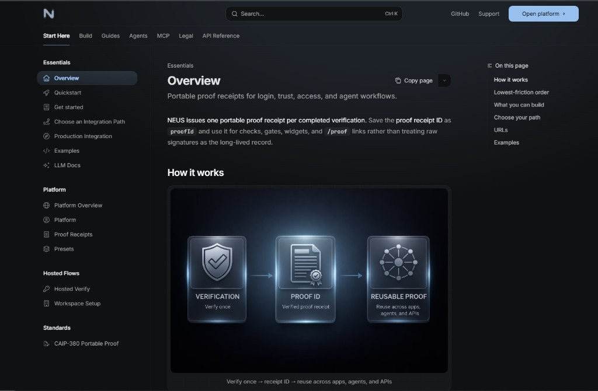

<p align="center">
  <a href="https://neus.network">
    
  </a>
</p>

<h1 align="center">NEUS</h1>

<p align="center">
  <strong>Verify once. Prove everywhere.</strong><br/>
  Portable proof receipts for apps, APIs, and agents.
</p>

<p align="center">
  <a href="https://www.npmjs.com/package/@neus/sdk"></a>
  <a href="./LICENSE"></a>
  <a href="https://github.com/neus/network/discussions"></a>
</p>

<p align="center">
  <a href="https://docs.neus.network/quickstart"><strong>Quickstart</strong></a> · 
  <a href="https://docs.neus.network"><strong>Docs</strong></a> · 
  <a href="https://docs.neus.network/api/overview"><strong>API Reference</strong></a> · 
  <a href="https://docs.neus.network/mcp/overview"><strong>MCP</strong></a> · 
  <a href="./examples"><strong>Examples</strong></a>
</p>

---

One **`proofId`** for gates, APIs, agents. Private by default.

## Why NEUS

- One receipt, many checks
- Less bespoke verification code
- Default-private outputs
- SDK · widgets · HTTP · MCP
- Same format for humans and agents

## How it works

<p align="center">
  <a href="https://docs.neus.network#how-it-works" title="Open in docs">
    
  </a>
</p>

<p align="center"><em>Verify once → receipt ID → reuse across apps, agents, and APIs</em></p>

## Quick start

```bash
npm install @neus/sdk
```

```javascript
import { NeusClient } from '@neus/sdk';

const client = new NeusClient();

// 1. Verify (defaults: private, unlisted, original content stored — wallet-only access)
const proof = await client.verify({
  verifier: 'ownership-basic',
  content: 'My content',
  wallet: window.ethereum,
});

// 2. Save the receipt
const proofId = proof.proofId;

// 3. Reuse: gateCheck from anywhere
const check = await client.gateCheck({
  address: '0x...',
  verifierIds: ['ownership-basic'],
});
// check.data.eligible → true/false
```

> **No wallet?** [Hosted Verify](https://docs.neus.network/cookbook/auth-hosted-verify)

## What you can build

| Use case | Verifier |
|----------|----------|
| Human-only access | `proof-of-human` |
| NFT / token gates | `nft-ownership` · `token-holding` |
| Creator / authorship | `ownership-basic` |
| Org / domain | `ownership-dns-txt` · `ownership-org-oauth` |
| Agents | `agent-identity` · `agent-delegation` |
| Proof-backed content | `ownership-basic` + `proofId` |

## Start here

|  |  |
|--|--|
| ~5 min | [Quickstart](https://docs.neus.network/quickstart) |
| No code | [Hosted Verify](https://docs.neus.network/cookbook/auth-hosted-verify) |
| React | [Widgets](https://docs.neus.network/widgets/overview) |
| Server | [API](https://docs.neus.network/api/overview) |
| Agents | [MCP](https://docs.neus.network/mcp/overview) |
| Hub + billing | [Get started](https://docs.neus.network/get-started) |

## Paths

| Path | Fit | Effort |
|------|-----|--------|
| [**Hosted Verify**](https://docs.neus.network/cookbook/auth-hosted-verify) | Guided login | Redirect or popup |
| [**Widgets**](https://docs.neus.network/widgets/overview) | React gates | `<VerifyGate>` |
| [**SDK**](https://docs.neus.network/sdks/overview) | Custom | Full control |
| [**API**](https://docs.neus.network/api/overview) | Server-only | HTTP |
| [**MCP**](https://docs.neus.network/mcp/overview) | Assistants | `https://mcp.neus.network/mcp` |

## Gate content in React

```jsx
import { VerifyGate } from '@neus/sdk/widgets';

<VerifyGate
  requiredVerifiers={['nft-ownership']}
  verifierData={{ 'nft-ownership': { contractAddress: '0x...', tokenId: '1', chainId: 1 } }}
  proofOptions={{
    privacyLevel: 'public',
    publicDisplay: false,
  }}
>
  <PremiumContent />
</VerifyGate>
```

## MCP

Add NEUS with one URL:

```json
{
  "mcpServers": {
    "neus": {
      "type": "streamableHttp",
      "url": "https://mcp.neus.network/mcp"
    }
  }
}
```

Hosted links from tools (passkeys stay on NEUS). [Setup](https://docs.neus.network/mcp/setup)

## AI assistants and CLI bootstrap

- **Machine-readable doc index:** [`llms.txt`](https://docs.neus.network/llms.txt) — use with [LLM docs](https://docs.neus.network/platform/llm-docs) so assistants pick the lowest-friction path (credits, hosted verify, MCP URL-only).
- **Copy-paste MCP + links (stdout only, no file writes):**

```bash
npx -y -p @neus/sdk neus init
```

## Docs

|  |  |
|--|--|
| [**Quickstart**](https://docs.neus.network/quickstart) | First proof |
| [**Verifiers**](https://docs.neus.network/verification/verifiers) | Types |
| [**API**](https://docs.neus.network/api/overview) | HTTP |
| [**SDK**](https://docs.neus.network/sdks/javascript) | JS |
| [**Examples**](./examples/) | React, Node, curl |

## Support

|  |  |
|--|--|
| [Docs](https://docs.neus.network) | Guides |
| [Discussions](https://github.com/neus/network/discussions) | Q&A |
| [Issues](https://github.com/neus/network/issues) | Bugs |
| [dev@neus.network](mailto:dev@neus.network) | Security (private) |

Repository conventions and documentation standards: [CONTRIBUTING.md](./CONTRIBUTING.md).

## License

- **SDK & tools:** Apache-2.0
- **Smart contracts:** BUSL-1.1 → Apache-2.0 (Aug 2028)
