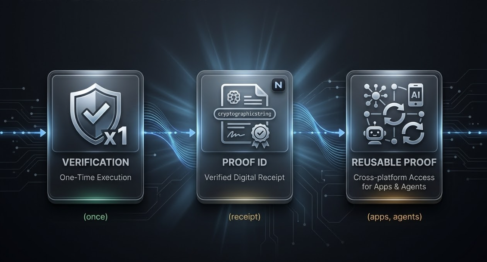

<p align="center">
  <a href="https://neus.network">
    
  </a>
</p>

<h1 align="center">NEUS</h1>

<p align="center">
  <strong>Verify once. Prove everywhere.</strong><br/>
  Portable proof receipts for apps, APIs, and agents.
</p>

<p align="center">
  <a href="https://www.npmjs.com/package/@neus/sdk"></a>
  <a href="./LICENSE"></a>
  <a href="https://github.com/neus/network/discussions"></a>
</p>

<p align="center">
  <a href="https://docs.neus.network"><strong>Docs</strong></a> ·
  <a href="https://docs.neus.network/quickstart"><strong>Quickstart (SDK)</strong></a> ·
  <a href="https://docs.neus.network/get-started"><strong>Get started</strong></a> ·
  <a href="https://docs.neus.network/api/overview"><strong>API</strong></a> ·
  <a href="https://docs.neus.network/mcp/overview"><strong>MCP</strong></a> ·
  <a href="./examples"><strong>Examples</strong></a>
</p>

---

One **proof receipt ID** (`proofId`, same value as `qHash` on the wire) for gates, APIs, and agents. Raw **`client.verify()`** is private by default. **`VerifyGate`** create mode defaults to unlisted public for reuse-first gates. See [Security and trust](https://docs.neus.network/platform/security-and-trust).

## Why NEUS

- One receipt, many checks
- Less bespoke verification code
- Raw SDK defaults to private stored receipts; widgets default to unlisted public for gates
- SDK · widgets · HTTP · MCP
- Same format for humans and agents

## How it works

<p>
  <a href="https://docs.neus.network#how-it-works" title="NEUS docs — Overview">
    
  </a>
</p>

<p align="center"><em>Verify once → receipt ID → reuse across apps, agents, and APIs</em></p>

## Quick start (SDK)

```bash
npm install @neus/sdk
```

```javascript
import { NeusClient } from '@neus/sdk';

const client = new NeusClient({
  appId: 'your-app-id', // optional for local try; register app in console before production
});

const proof = await client.verify({
  verifier: 'ownership-basic',
  content: 'My content',
  wallet: window.ethereum,
});

const proofId = proof.proofId;

const check = await client.gateCheck({
  address: '0x...',
  verifierIds: ['ownership-basic'],
});
```

> **No wallet in your app?** [Hosted Verify](https://docs.neus.network/cookbook/auth-hosted-verify) · **Shipping:** [Get started](https://docs.neus.network/get-started) (`appId`, credits).

## What you can build

| Use case | Verifier |
|----------|----------|
| Human-only access | `proof-of-human` |
| NFT / token gates | `nft-ownership` · `token-holding` |
| Creator / authorship | `ownership-basic` |
| Org / domain | `ownership-dns-txt` · `ownership-org-oauth` |
| Agents | `agent-identity` · `agent-delegation` |

[Verifiers →](https://docs.neus.network/verification/verifiers)

## Start here

| You are… | Link |
|----------|------|
| Shipping a product (`appId`, credits) | [Get started](https://docs.neus.network/get-started) |
| First proof in code | [Quickstart](https://docs.neus.network/quickstart) |
| No embedded wallet / guided login | [Hosted Verify](https://docs.neus.network/cookbook/auth-hosted-verify) |
| React gates | [Widgets](https://docs.neus.network/widgets/overview) |
| Cursor / Claude / VS Code | [MCP](https://docs.neus.network/mcp/overview) |
| Compare all paths | [Paths](https://docs.neus.network/choose-an-integration-path) |

## Gate in React

```jsx
import { VerifyGate } from '@neus/sdk/widgets';

<VerifyGate
  appId="your-app-id"
  requiredVerifiers={['nft-ownership']}
  verifierData={{ 'nft-ownership': { contractAddress: '0x...', tokenId: '1', chainId: 1 } }}
>
  <PremiumContent />
</VerifyGate>
```

## MCP

```json
{
  "mcpServers": {
    "neus": {
      "type": "streamableHttp",
      "url": "https://mcp.neus.network/mcp"
    }
  }
}
```

[Setup](https://docs.neus.network/mcp/setup)

## AI assistants

[`llms.txt`](https://docs.neus.network/llms.txt) · [LLM docs](https://docs.neus.network/platform/llm-docs) · CLI: `npx -y -p @neus/sdk neus init`

## Support

|  |  |
|--|--|
| [Docs](https://docs.neus.network) | Guides |
| [Discussions](https://github.com/neus/network/discussions) | Q&A |
| [Issues](https://github.com/neus/network/issues) | Bugs |
| [dev@neus.network](mailto:dev@neus.network) | Security (private) |

[CONTRIBUTING.md](./CONTRIBUTING.md)

## License

- **SDK & tools:** Apache-2.0
- **Smart contracts:** BUSL-1.1 → Apache-2.0 (Aug 2028)
