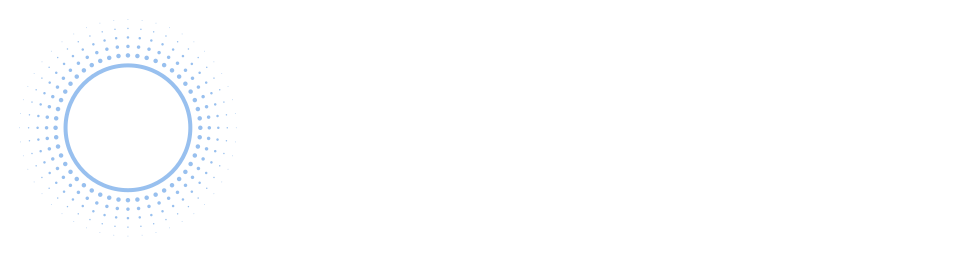

<h1 align="center">NEUS Network — The Portable Trust Layer</h1>

<p align="center">
  
</p>

<p align="center">
  NEUS makes trust portable across the internet, so people, apps, and AI agents can prove what is real before access, payout, or execution.
</p>

<p align="center">
  <a href="https://www.npmjs.com/package/@neus/sdk"></a>
  <a href="./LICENSE"></a>
  <a href="https://github.com/neus/network/discussions"></a>
</p>

<p align="center">
  <a href="#why-neus"><strong>Why NEUS</strong></a>
  | <a href="#start-building"><strong>Start building</strong></a>
  | <a href="#live-surfaces"><strong>Live surfaces</strong></a>
</p>

---

## Why NEUS

Every app, marketplace, workflow, and agent stack rebuilds trust from zero. NEUS turns trust decisions into **reusable trust receipts** that apps, agents, gates, and audit systems can check before access, payment, or action.

A trust receipt proves a check already happened: identity, ownership, authority, or permission. Show it on a profile, attach it to a gate, or validate it through the API. Trusted actors move across surfaces; unknown or risky actors hit policy gates.

| Need | What you get with NEUS |
| ---- | ------------------------ |
| Stop rebuilding verification in every product | One receipt you can save, check, and reuse across apps |
| Gate access, rewards, or content | Hosted flows, React widgets, and server-side allow/deny checks |
| Trust agents before they act | Verifiable identity, scoped delegation, and receipts for every action |
| Audit what happened | Receipt pages, durable references, and a record of passes and denials |
| Add trust without building the ceremony | Hosted Verify, SDK, API, and MCP on the same trust model |

## Start building

### One command for assistants

Run this in any project. It detects your editor and wires hosted NEUS MCP for Cursor, VS Code, Claude Code, or Codex.

```bash
npx -y -p @neus/sdk neus setup
npx -y -p @neus/sdk neus check
```

Then ask your assistant: **"Use NEUS Verify before taking sensitive actions."**

| Path | Next step |
| ---- | --------- |
| AI assistants | [Install NEUS](https://docs.neus.network/install) |
| MCP setup | [MCP setup](https://docs.neus.network/mcp/setup) |
| App verification | [Quickstart](https://docs.neus.network/quickstart) |

### Add trust to an app

Use Hosted Verify, `VerifyGate`, or the SDK when your app needs a reusable trust receipt.

- [Quickstart](https://docs.neus.network/quickstart) — register your app and run the workflow.
- Follow the pattern: [check, verify, save, reuse](https://docs.neus.network/integration).
- Use [Hosted Verify](https://docs.neus.network/cookbook/auth-hosted-verify) when NEUS should own the browser step.

### Add trust to an agent

- [Agents overview](https://docs.neus.network/agents/overview) — identity, scoped authority, and receipts for agents that act.
- Register identity with [`agent-identity`](https://docs.neus.network/agents/agent-identity).
- Add scoped authority with [`agent-delegation`](https://docs.neus.network/agents/agent-delegation).

Hosted MCP URL: **`https://mcp.neus.network/mcp`**

---

## Live surfaces

| Surface | Use it for |
| ------- | ---------- |
| [Hosted Verify](https://neus.network/verify) | Browser verification for users |
| [Trust receipts](https://docs.neus.network/platform/receipts-and-results) | Portable verification records and eligibility checks |
| [SDK](https://docs.neus.network/sdks/javascript) | Verification, polling, hosted URLs, and server-side checks |
| [Widgets](https://docs.neus.network/widgets/overview) | `VerifyGate` and `ProofBadge` for React products |
| [API](https://docs.neus.network/api/overview) | Server reads, checks, verifier catalog, and verification endpoints |
| [Agents](https://docs.neus.network/agents/overview) | Agent identity, delegation, stable URLs, and action receipts |
| [MCP](https://docs.neus.network/mcp/overview) | Live trust context for assistants, tools, and agent workflows |

## Choose your path

| Path | Best next step |
| ---- | ---------------- |
| First app integration | [Quickstart](https://docs.neus.network/quickstart) |
| Build a flow | [Integration guide](https://docs.neus.network/integration) |
| React gate | [VerifyGate](https://docs.neus.network/widgets/verifygate) |
| Server/API | [API overview](https://docs.neus.network/api/overview) |
| Agent trust | [Agents overview](https://docs.neus.network/agents/overview) |
| Assistants/MCP | [MCP setup](https://docs.neus.network/mcp/setup) |

## Capability snapshot

The live verifier catalog is documented at [docs.neus.network/verification/verifiers](https://docs.neus.network/verification/verifiers). JSON Schemas live in [`docs/verifiers/schemas/`](./docs/verifiers/schemas/); the machine index is [`spec/VERIFIERS.json`](./spec/VERIFIERS.json).

| Capability | Verifiers |
| ---------- | --------- |
| Ownership and identity | `ownership-basic`, `ownership-social`, `ownership-dns-txt`, `ownership-org-oauth`, `ownership-pseudonym` |
| Human and wallet trust | `proof-of-human`, `wallet-risk`, `wallet-link` |
| Assets and contracts | `token-holding`, `nft-ownership`, `contract-ownership` |
| Content and safety | `ai-content-moderation` |
| Agent trust | `agent-identity`, `agent-delegation` |

## This repository

Public docs, SDK (`@neus/sdk`), widgets, examples, specs, and the NEUS Claude Code plugin for Cursor.

## Where to go next

- [docs.neus.network](https://docs.neus.network) — product docs and setup.
- [Integration guide](https://docs.neus.network/integration) — the check, verify, save, reuse flow.

## NEUS in production

| Surface | Link |
| ------- | ---- |
| Product | [neus.network](https://neus.network) |
| Hosted Verify | [neus.network/verify](https://neus.network/verify) |
| Docs | [docs.neus.network](https://docs.neus.network) |
| SDK | [npm: @neus/sdk](https://www.npmjs.com/package/@neus/sdk) |
| MCP | [npm: @neus/sdk](https://www.npmjs.com/package/@neus/sdk) (`neus setup`) |
| Examples | [`examples/`](./examples) |
| Verifier catalog | [docs.neus.network/verification/verifiers](https://docs.neus.network/verification/verifiers) |

## Support

| Channel | Use for |
| ------- | ------- |
| [Docs](https://docs.neus.network) | Product and integration guidance |
| [Changelog](./CHANGELOG.md) | Release notes and upgrade paths |
| [Platform status](https://docs.neus.network/platform/status) | Maturity, beta scope, and upgrade expectations |
| [Discussions](https://github.com/neus/network/discussions) | Questions and implementation patterns |
| [Issues](https://github.com/neus/network/issues) | Bugs and requests |
| [dev@neus.network](mailto:dev@neus.network) | Security |

## License

- **SDK and tools:** Apache-2.0
- **Smart contracts:** BUSL-1.1 to Apache-2.0 in August 2028
