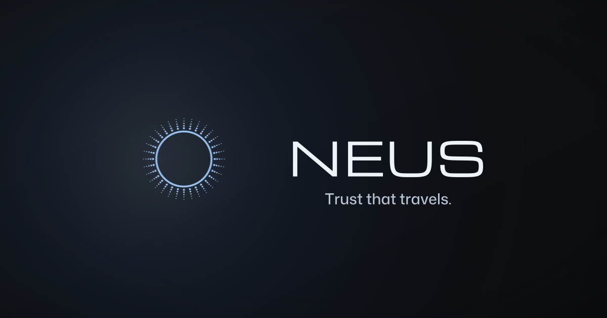

<h1 align="center">NEUS: Portable Trust Infrastructure</h1>

<p align="center">
  
</p>

<p align="center">
  <strong>Don't restart from zero.</strong>
</p>

<p align="center">
  One private profile for your identity, context, permissions, and proof. Portable across apps, agents, services, and transactions.
</p>

<p align="center">
  <em>Built for people and AI.</em>
</p>

<p align="center">
  <a href="https://www.npmjs.com/package/@neus/sdk"></a>
  <a href="https://www.npmjs.com/package/@neus/mcp-server"></a>
  <a href="./LICENSE"></a>
  <a href="https://github.com/neus/network/discussions"></a>
  <a href="https://neus.network/proof/0x1487d0d9826ffc2c415b33745a058711f1c4d8928d64df5c7104752ed6d62cc0"></a>
</p>

<p align="center">
  <a href="#why-neus"><strong>Why NEUS</strong></a>
  | <a href="#start-building"><strong>Start building</strong></a>
  | <a href="#live-surfaces"><strong>Live surfaces</strong></a>
  | <a href="#support"><strong>Support</strong></a>
</p>

---

## Why NEUS

Every new app makes you reconnect yourself. Rebuild identity. Re-prove ownership. Reconfigure permissions. Reattach tools. Create another isolated audit trail. Starting over every time is the tax every app, agent, and transaction pays.

NEUS collapses that cost. One private profile holds what you've proven and what you're allowed to do. Carry it across apps, agents, services, and transactions. Any connected system can check it when it matters.

A proof is something you already earned. Who someone is, what they own, what they are allowed to do. Put it on a profile, require it at a gate, or check it from your API. Same proof, every surface.

### Your AI shouldn't start from zero either

Give any agent the identity, context, tools, permissions, and proofs it needs without rebuilding everything for every model or framework. Same profile. New agent. Your AI has access. NEUS gives it authority.

| Need | What you get with NEUS |
| ---- | ------------------------ |
| Stop re-proving the same facts in every product | One portable proof apps and agents can reuse |
| Carry identity and ownership with the actor | Profiles and ownership proofs that travel across gates |
| Authorize actions with clear limits | Scoped permissions, current status, and enforce-before-act checks |
| Keep provenance with people and AI | Live proofs in the editor, product, and API |
| Audit who did what, and under which authority | Proof pages, stable references, and reviewable history |
| Gate once. Monetize every qualified visitor | Published gates own the checks, price, and sign-in |

## Start building

### One command for assistants

Connect once. Your assistant carries your identity, provenance, and scoped authority across editors, reusing what's verified, checking limits before sensitive actions, and leaving a proof for every result.

```bash
npx -y -p @neus/sdk neus setup
npx -y -p @neus/sdk neus auth
npx -y -p @neus/sdk neus doctor --live
```

`neus setup` registers MCP and installs the workflow skill. `neus auth` signs you in (or click **Connect** in your host). `neus doctor --live` confirms the connection.

### Or paste this into your agent

Copy the block below into Claude Code, Cursor, Codex, or any coding agent with NEUS MCP. The agent reads it, runs setup, signs you in, and starts carrying your authority.

```text
# NEUS connect in one prompt

You are connecting this editor to NEUS so my identity, provenance, and
authority travel with me. Follow these steps exactly.

## 1. Register NEUS
Run: npx -y -p @neus/sdk neus setup
This installs the public workflow skill and writes MCP config for every
supported host in this project. It does not open a browser.

## 2. Sign in
Run: npx -y -p @neus/sdk neus auth
Or click Connect in the MCP client. Default sign-in is browser OAuth.
No wallet required.

## 3. Confirm the connection
Run: npx -y -p @neus/sdk neus doctor --live
A healthy result confirms the endpoint, auth, and public tools.

## 4. What to do next
After setup, reuse my existing proofs before asking me to verify again.
Before any sensitive action (spend, publish, secrets, agent tool call),
call neus_context once, then neus_proofs_check. Summarize as
NEUS Verify: Passed, Action needed, or Blocked.

Canonical endpoint: https://mcp.neus.network/mcp
Docs: https://docs.neus.network/mcp/setup
```

Then ask your assistant:

> Use NEUS so my identity, provenance, and authority travel with me. Reuse proofs when you can, verify when you must, and check authority before sensitive actions.

| Path | Next step |
| ---- | --------- |
| AI assistants | [MCP setup](https://docs.neus.network/mcp/setup). Hosted URL `https://mcp.neus.network/mcp` |
| First app integration | [Quickstart](https://docs.neus.network/quickstart) |
| Reuse everywhere | [Integration guide](https://docs.neus.network/integration) |
| React gate | [VerifyGate](https://docs.neus.network/widgets/verifygate) |
| Server / API | [API overview](https://docs.neus.network/api/overview) |
| Agent trust | [Agents overview](https://docs.neus.network/agents/overview) |

Install **`neus-mcp`** from this repo's marketplace to connect Cursor in one click. See [MCP setup](https://docs.neus.network/mcp/setup).

### Add trust to an app

Drop in Hosted Verify, `VerifyGate`, or the SDK when your app needs portable trust: provenance at the gate, authority before access, proofs you can audit later.

- [Quickstart](https://docs.neus.network/quickstart) to register your app and ship the first proof.
- Pattern: [prove once, reuse everywhere](https://docs.neus.network/integration).
- [Hosted Verify](https://docs.neus.network/cookbook/auth-hosted-verify) for browser sign-in and checks.

### Add trust to an agent

Give agents identity and scoped authority as proofs so tools run under real limits and every action stays auditable.

- [Agents overview](https://docs.neus.network/agents/overview): identity, permissions, and reusable proofs.
- Register identity with [`agent-identity`](https://docs.neus.network/agents/agent-identity).
- Add permissions with [`agent-delegation`](https://docs.neus.network/agents/agent-delegation).

---

## Live surfaces

| Surface | Use it for |
| ------- | ---------- |
| [Product](https://neus.network) | Profiles, gates, and hosted product UX |
| [Hosted Verify](https://neus.network/verify) | Browser verification for people and orgs |
| [Proofs](https://docs.neus.network/platform/proofs) | Portable records of identity, authority, and outcomes |
| [SDK](https://docs.neus.network/sdks/javascript) ([@neus/sdk](https://www.npmjs.com/package/@neus/sdk)) | Issue, poll, and check proofs from your app |
| [Widgets](https://docs.neus.network/widgets/overview) | `VerifyGate` and `ProofBadge` for React products |
| [API](https://docs.neus.network/api/overview) | Server reads, checks, verifier catalog, and verification endpoints |
| [Agents](https://docs.neus.network/agents/overview) | Agent identity, scoped authority, and audit-ready proofs |
| [MCP](https://docs.neus.network/mcp/overview) | Portable identity, provenance, and authority for any client. `neus setup`; registry metadata: [`@neus/mcp-server`](https://www.npmjs.com/package/@neus/mcp-server) |
| [Examples](./examples) | Runnable app and agent samples |
| [Verifier catalog](https://docs.neus.network/verification/verifiers) | Live check IDs and inputs |

## Capability snapshot

The live verifier catalog is documented at [docs.neus.network/verification/verifiers](https://docs.neus.network/verification/verifiers). JSON Schemas live in [`docs/verifiers/schemas/`](./docs/verifiers/schemas/); the machine index is [`spec/VERIFIERS.json`](./spec/VERIFIERS.json).

| Capability | Verifiers |
| ---------- | --------- |
| Ownership and identity | `ownership-basic`, `ownership-social`, `ownership-dns-txt`, `ownership-org-oauth`, `ownership-pseudonym` |
| Human and wallet trust | `proof-of-human`, `wallet-risk`, `wallet-link` |
| Assets and contracts | `token-holding`, `nft-ownership`, `contract-ownership` |
| Content and safety | `ai-content-moderation` |
| Agent trust | `agent-identity`, `agent-delegation` |

## This repository

Public docs, SDK (`@neus/sdk`), MCP registry package (`@neus/mcp-server`), widgets, examples, specs, and the **`neus-mcp`** editor plugin ([setup](https://docs.neus.network/mcp/setup)).

## Open standard

NEUS is the driving reference implementation of [CAIP-380 (Portable Proof)](https://standards.chainagnostic.org/CAIPs/caip-380), a ChainAgnostic standard at Draft status. Wallet-signed request envelopes have a deterministic SHAKE-256 hash (`qHash`), CAIP-2 chain context, and CAIP-10 / `did:pkh` identities. Their hash, DID binding, and signature can be checked without NEUS; verifier outcomes remain part of the NEUS portable proof. The envelope is chain-agnostic and accepts any CAIP-2 namespace. NEUS ships EVM (EIP-191, EIP-1271, EIP-6492) and Solana (Ed25519) signing profiles today, with offline fixtures. See the [EVM fixture](./examples/caip-380/minimal-evm.json), the [Solana fixture](./examples/caip-380/minimal-solana.json), the [CAIP-380 docs](https://docs.neus.network/learn/standards/caip-380), the [Technical Whitepaper](https://docs.neus.network/whitepaper), and the [standards chronology](./HISTORY.md).

## Support

| Channel | Use for |
| ------- | ------- |
| [Docs](https://docs.neus.network) | Product and integration guidance |
| [Changelog](./CHANGELOG.md) | Release notes and upgrade paths |
| [Platform](https://docs.neus.network/platform/overview) | Hosted product, API, and upgrade path |
| [Discussions](https://github.com/neus/network/discussions) | Questions and implementation patterns |
| [Issues](https://github.com/neus/network/issues) | Bugs and requests |
| [SECURITY.md](./SECURITY.md), [dev@neus.network](mailto:dev@neus.network) | Vulnerability disclosure |

## Status

NEUS is under active development. Published APIs and verifier schemas may change between minor versions before the long-term stability freeze. We version everything we ship and document every breaking change in the [changelog](./CHANGELOG.md).

## Audit

Smart contracts were audited by [SafeStack AI](https://safestackai.com) in March 2026. The audit completed with no critical, high, medium, or low severity findings. See the [Trust Center](https://docs.neus.network/platform/security-and-trust#smart-contract-audit) for details.

## Partners and programs

- **Webacy, ZKPassport, Phala Network:** integration partnerships for verification, zero-knowledge identity, and confidential compute
- **NVIDIA Inception:** early-stage AI startup program
- **Google for Startups:** cloud and AI startup program
- **Optimism Retro Funding Season 8:** grant recipient

## License

All code in this repository is Apache-2.0, including the reference smart contracts. The CAIP-380 specification is released under CC0 1.0. NEUS names and logos are protected trademarks; see [TRADEMARKS.md](./TRADEMARKS.md).
